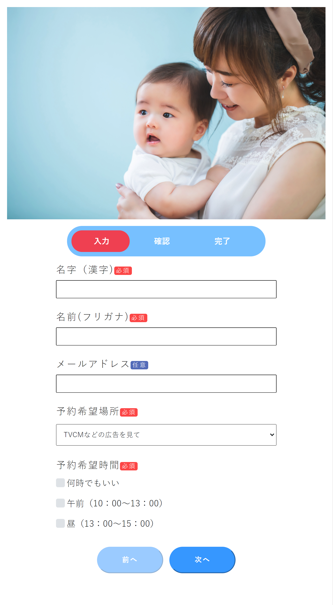

# WEB予約フォーム | PHP, HTML, CSS, jQuery

## 1.Vendor/sendmail.php
* Server settings  

        $mail->Host	= 'smtp.gmail.com';  //メール転送のためのSMTPサーバーのメールを設定します。
        $mail->Username	=	'Your@gmail.com';	//SMTPサーバーのユーザー名。 
        $mail->Password = 	'YourPassword';		//SMTPサーバーのパスワード。

* Recipients  

        $mail->setFrom('From@example.com', 'ジーラボ株式会社');     //予約申し込みをするユーザーのメールアドレス【任意】
        $mail->addAddress('To@example.com', 'ジーラボ株式会社');    //受信者のメールを追加します 【必須】
        $mail->addReplyTo('info@example.com', 'Information');     //に返信メールを追加。

## 2.Vendor/replymail.php
### ▼以下の項目を除いた他の項目は、前と同じように設定します。

* Server settings  

        $mail->Host	= 'smtp.gmail.com';  //メール転送のためのSMTPサーバーのメールを設定します。
        $mail->Username	=	'Your@gmail.com';	//SMTPサーバーのユーザー名。 
        $mail->Password = 	'YourPassword';		//SMTPサーバーのパスワード。
    
* Recipients  

        $mail->setFrom('From@example.com', 'ジーラボ株式会社');     //予約申し込みをするユーザーのメールアドレス【任意】

## Author: Dmitri Belov
&copy; 2021 WWd Team, All Rights Reserved.

